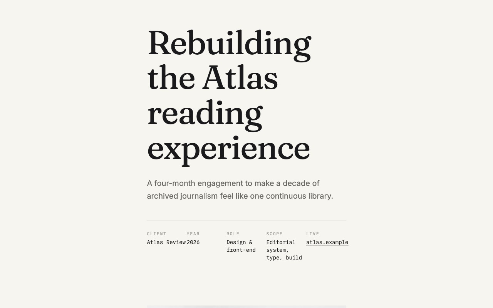

# Web Stylebook

[](./README.en.md)
[](./README.ko.md)
[](./README.ja.md)

**A practical design reference and implementation handoff for frontend teams and AI coding agents.**

Web Stylebook connects three parts of design work that are often scattered across separate resources:
choosing a visual direction, applying UX and interface design principles, and turning the result into an
implementation-ready prompt.

[Live site](https://webstylebook.com) ·
[Real References](https://webstylebook.com/pages/reference-explorer) ·
[Design Guide](https://webstylebook.com/pages/ux-principles) ·
[Prompt Generator](https://webstylebook.com/pages/prompt-workflow) ·
[Web Stylebook MCP](https://github.com/seungdori/web-stylebook-mcp)



## What you can do

### Explore a direction

- Browse 32 base styles and 16 deliberately composed fusion styles.
- Search 520 real-world reference observations with measured color, type, spacing, layout, and motion signals.
- Open complete React-rendered examples instead of judging a direction from a thumbnail.
- Compare two styles side by side before committing to a visual language.

### Use a shared design language

- Turn 23 UX principles into design questions, application guidance, cautions, and observable checks.
- Review 25 interface design principles across purpose, evidence, hierarchy, layout, type, color, media, navigation, interaction, states, and recovery.
- Explain 20 common UI component terms in plain language with live examples.

### Move from reference to implementation

- Test color contrast and export CSS or JSON design tokens.
- Explore 29 motion patterns through live previews and implementation prompts.
- Generate an AI-ready design handoff that keeps style, tokens, motion, component foundations, and QA constraints connected.
- Expose the same canonical catalog to coding agents through the standalone MCP package.

## Catalog at a glance

| Reference | Count | Purpose |
| --- | ---: | --- |
| Base styles | 32 | Complete visual directions |
| Fusion styles | 16 | Purpose-built combinations of two design languages |
| Real-world references | 520 | Source-linked observations and measured tokens without mirrored screenshots |
| UX principles | 23 | Behavior, psychology, interaction, and verification |
| Interface design principles | 25 | Purpose, evidence, structure, interaction, and state coverage |
| Component terms | 20 | Shared UI vocabulary with examples |
| Motion patterns | 29 | Searchable live previews and prompt language |
| Languages | 3 | English, Korean, and Japanese routes |

## Information architecture

The site separates knowledge from interactive utilities:

| Design Guide | Tools |
| --- | --- |
| [UX Principles](https://webstylebook.com/pages/ux-principles) | [Style Compare](https://webstylebook.com/pages/compare) |
| [Real References](https://webstylebook.com/pages/reference-explorer) | [Color System](https://webstylebook.com/pages/color-system) |
| [Interface Design Principles](https://webstylebook.com/pages/design-principles) | [Animation Lab](https://webstylebook.com/pages/animation-lab) |
| [Component Glossary](https://webstylebook.com/pages/component-glossary) | [Prompt Tips](https://webstylebook.com/pages/prompt-tips) |

`Design Guide` pages are independent, deep-linkable references with shared sibling navigation.
`Tools` are workspaces for comparing, testing, previewing, and producing an output.

## AI handoff and MCP

The [Prompt Generator](https://webstylebook.com/pages/prompt-workflow) produces a structured workflow
for AI-assisted frontend work. Agents can also fetch
[`/agent-handoff.json`](https://webstylebook.com/agent-handoff.json) to read the usage guide, style
catalog, anti-patterns, verification checklist, build prompt, and self-audit prompt without executing
client-side JavaScript.

The standalone [`web-stylebook-mcp`](https://github.com/seungdori/web-stylebook-mcp) package provides
deterministic, read-only design intelligence from the same canonical catalog:

- product-fit style selection with reasons and rejected alternatives;
- UX and interface-design-principle planning by outcome, surface, and phase;
- screen hierarchy, state coverage, and design-token composition;
- warnings against generic or inaccessible interface choices.

```json
{
  "mcpServers": {
    "web-stylebook": {
      "command": "npx",
      "args": ["-y", "web-stylebook-mcp@latest"]
    }
  }
}
```

## Development

```bash
npm install
npm run dev
```

The site is built with React, TypeScript, and Vite. It produces static output in `dist/`; canonical
URLs, localized routes, hreflang links, the sitemap, SEO metadata, and the agent handoff are generated
from typed source data.

## Verification

```bash
npm run typecheck
npm run lint
npm run i18n:check
npm run test
npm run mcp:catalog
npm run mcp:catalog:check
npm run mcp:catalog:validate
npm run build
```

Preview the production output with:

```bash
python3 -m http.server 4173 -d dist
```

## Source map

- `src/data/styles.ts` — style cards, prompt profiles, palettes, and metadata.
- `src/ported/pages/*.tsx` — React source of truth for all 48 style pages.
- `src/ported/portedStylePages.css` — page-specific visual motifs and interactions.
- `src/catalog/principles.ts` — canonical UX-principle catalog.
- `src/catalog/designPrinciples.ts` — canonical visual-design-principle catalog.
- `src/catalog/components.ts` — canonical component vocabulary.
- `src/catalog/references.generated.json` — normalized real-world observations and measured tokens with pinned provenance.
- `src/pages/animation-lab/catalog.ts` — motion-pattern catalog.
- `src/data/routes.ts` — routes, localized metadata, canonical URLs, and hreflang data.
- `scripts/generate-static-pages.mjs` — static HTML and legacy `.html` compatibility aliases.
- `scripts/generate-agent-handoff.mjs` — complete machine-readable AI handoff.
- `scripts/import-design-references.mts` — pinned, retrying OpenDesign importer with quality and rights gates.
- `public/previews/*.html` — archived fidelity references, not production render sources.

English routes are unprefixed. Korean and Japanese routes use `/ko/` and `/ja/`. Canonical navigation
uses extensionless URLs, while legacy `.html` aliases remain available for compatibility.

## License

[CC BY-NC 4.0](./LICENSE)

The UX-principle field guide is independently written and attributes
[Laws of UX](https://lawsofux.com) (CC BY-NC-ND 4.0) as an index reference. Laws of UX prose,
illustrations, and page layouts are not included.

The independently authored UX and visual-design catalogs are also distributed under MIT through
[`web-stylebook-mcp`](https://github.com/seungdori/web-stylebook-mcp).

The real-world reference library adapts structured OpenDesign specifications under
[CC BY 4.0](https://creativecommons.org/licenses/by/4.0/). Web Stylebook retains only normalized
observations and measured tokens, records the upstream revision and modification notice, and excludes
source screenshots, logos, fonts, copy, and brand assets. Rights in each original site and visual
identity remain with their respective owners.
